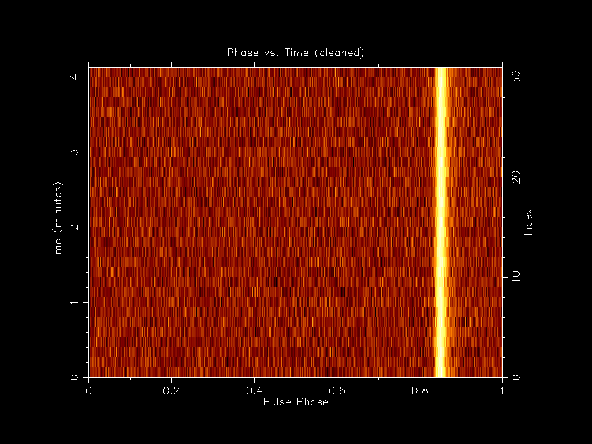
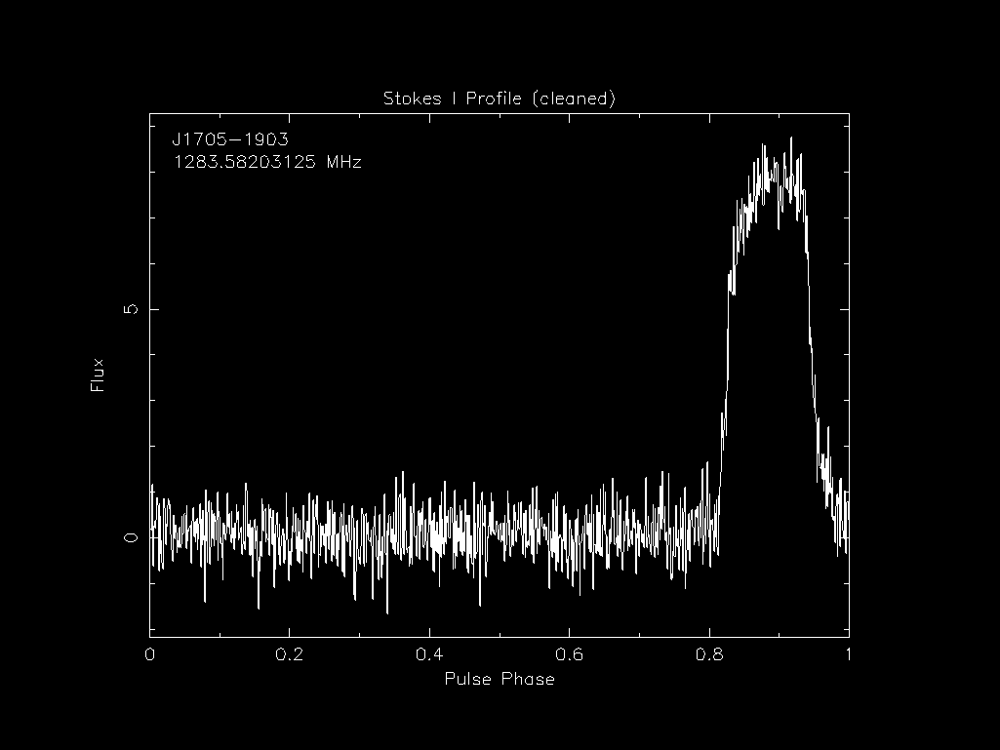
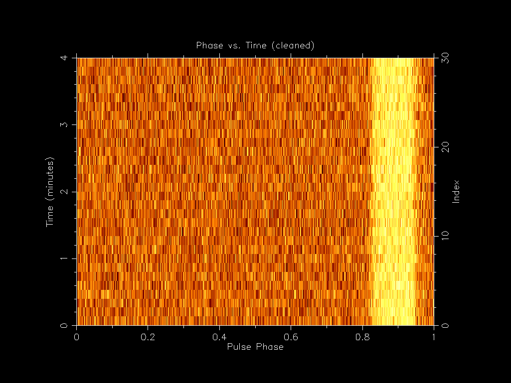
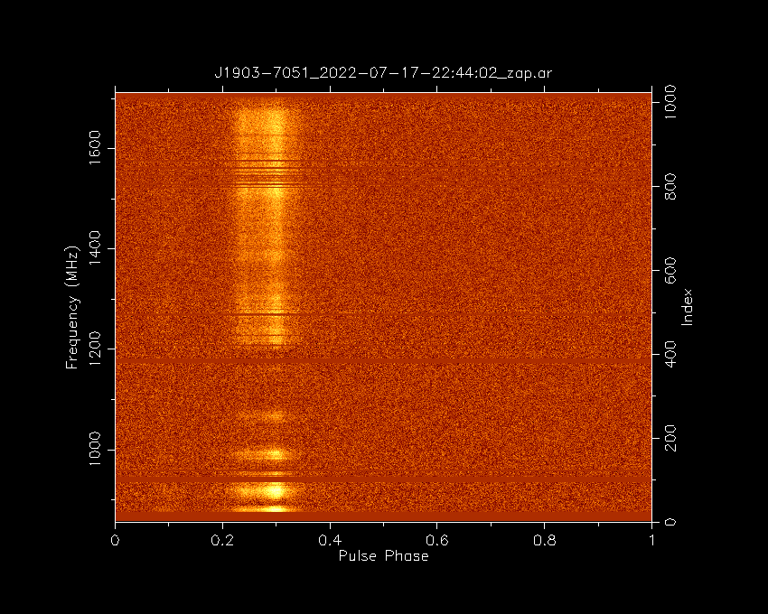

# Introduction

In this lesson we will go over how to interact with pulsar data.
We will go over the different types of data, how to plot them and how to clean them.

The data we will use for this lesson is in the `pulsar_data` directory so move to the directory before following alone:

```
cd /home/pulsar/pulsar_data_lesson
```
{: .language-bash}


## Pulsar data types

Pulsar data are typically stored as a three-dimensional array of pulse profiles the axes being time (sub-integrations), observing frequency (channels) and polarization.
Each data file (typically termed as archives) have attributes (metadata) that describe the pulsar observation.
Pulsar data can be broadly sorted into two types, "raw voltage" which is the time series data as it comes off the telescope and "folded" which has been folded and dedisperesed using a timing ephemeris.

Some formats for raw voltage files include `PSRFITS`, `PSRDADA` and `VDIF`.
Before analyzing the data you often have to fold and dedisperse the data which is often done with `dspsr` (explained in the next section).

The folded data are often called archives and have `.ar` at the end of their filename.
Many telescopes (such as MeerKAT) have a pulsar timing backend that will automatically produce a folded archive to save processing and data size.

## DSPSR

[DSPSR](https://dspsr.sourceforge.net/manuals/dspsr/) is not installed on the VM or need for MeerKAT data but it is still useful to know how to use to process other data and to understand MeerKAT data.
`dspsr` can perform phase-coherent dispersion removal while folding the data based on the input ephemeris.
The output data may be divided into sub-integrations of arbitrary length, including single pulses.
THe MeerKAT PTUSE outputs the archives in ~8 second sub-integrations so the equivalent `dspsr` command may look like this:

```
dspsr -F 128 -E 1644-4559.eph -L 8 raw_observation.data
```
where `-F 128` outputs a 128 frequency channel archive, `-E 1644-4559.eph` is the ephemeris file, `-L 8` outputs an archive for every 8 seconds of data and `raw_observation.data` is whatever the input raw voltage file is called (if there is one).

Because these archives have already been folded with an ephemeris, there is only so much you can do to improve your observation if the ephemeris is inaccurate.
For example below is a recent observation (2023-04-21-23:58:20) of PSR J1705-1903's profile and phase against time plots:




You can see that pulse is thin as expected.
If we then compare this to an early observation (2019-04-23-05:44:10) we can see that the pulse profile is much wider even though we have a applied a more recent ephemeris to it.




This is due to the PTUSE outputting the 8 second sub-integrations which have some timing smear in them due to the initial inaccurate ephemeris used during the observation.
If you ever want to inspect the ephemeris used to create an archive file you can use the following command:

```
vap -E <archive_file>
```
{: .language-bash}


## PSRCHIVE

Now that we have folded and dedisperesed archives, we can analysis them and one of the best packages to do that is PSRCHIVE.
PSRCHIVE is an Open Source C++ development library for the analysis of pulsar astronomical data.
The software is described [online](https://psrchive.sourceforge.net/index.shtml) and in [Hotan, van Straten & Manchester (2004)](http://www.publish.csiro.au/?paper=AS04022) and [Straten, Demorest & Osłowski 2012](https://arxiv.org/abs/1205.6276).

There is a [full list](https://psrchive.sourceforge.net/manuals/) of commands online and below are the most common ones:
 - `psrstat`	query attributes and statistics
 - `psradd`	combine data in various ways
 - `psrplot`	produce customized, publication quality plots
 - `vap`	output tables of parameters and derived values
 - `pav`	produce a wider variety of plots
 - `pam`	command line general purpose data reduction
 - `rmfit`	estimate the Faraday rotation measure
 - `pas`	generate template profiles (standards)
 - `pat`	produce time of arrival estimates
 - `paz`	RFI mitigation
 - `pdmp`	find optimal period and dispersion measure


## Making plots

One of the best commands to make plots is `psrplot`.
You can list all the types of plots that you can make with

```
psrplot -P
```
{: .language-bash}

```
Available Plots:
flux      [D]  Single plot of flux
stokes    [s]  Stokes parameters
Scyl      [S]  Stokes; vector in cylindrical
Scyl+     [E]  Stokes; vector in cylindrical+
Ssph      [m]  Stokes; vector in spherical
Sfluct    [U]  Stokes; fluctuation power spectra
Sflph     [u]  Stokes; fluctuation phase spectra
freq      [G]  Phase vs. frequency image of flux
freq+     [F]  freq + integrated profile and spectrum
time      [Y]  Phase vs. time image of flux
pa        [o]  Orientation (Position) angle
ell       [e]  Ellipticity angle
p3d       [P]  Stokes vector in Poincare space
pahist    [h]  Phase-resolved position angle histogram
pahist+   [H]  Phase-resolved PA histogram and total profile
psd       [b]  Pulsed power spectrum
2bit      [2]  Two-bit distribution
cal       [C]  Calibrator Spectrum
calm      [M]  Calibrator model information
calp      [p]  Calibrator parameter
line      [R]  Line phase subints
dspec     [j]  Dynamic S/N spectrum
dstat     [d]  Dynamic statistic spectrum
offdspec  [r]  Dynamic baseline spectrum
dcal      [l]  Calibrator dynamic spectrum
dweight   [w]  Weights dynamic spectrum
snrspec   [n]  S/N ratio
calphvf   [X]  Calibrator phase vs frequency plot
bandpass  [B]  Display original bandpass
chweight  [c]  Display Channel Weights
bpcw      [J]  Plot off-pulse bandpass and channel weights
digstats  [K]  Digitiser Statistics
digcnts   [A]  Digitiser Counts histogram
fourth    [4]  4x4 covariance of Stokes parameters
cross     [x]  1-D cross covariances between Stokes parameters
alt       [a]  Greyscale of auxiliary profiles
```
{: .output}

Some of the common types we will go over soon.
First we should explain some of the other `psrplot` commands.

You can preprocess the archives before plotting with the `-j` option.
You can use the following commands:
 - `T` Time scrunch to one subint
 - `F` Frequency scrunch to one channel
 - `p` Polarisation scrunch to total intensity
 - `D` Dedisperse (but not fscrunch)
 - `S` Transform to Stokes parameters
For example `-jTFDp` will dedisperse and time, frequency and polarisation scrunch.

You can define how to output the plot with the `-D` option so you could output the plot as a png with `-D output_name.png/png`.

### Pulse profile

Lets give it a go and try to make a pulse profile plot with the command:

```
psrplot -p flux -jFTDp -D J1903-7051_profile_fts.png/png J1903-7051_2022-07-17-22:44:02_zap.ar
```
{: .language-bash}


You can also remove the `-D J1903-7051_profile_fts.png/png` part and it will open the plot in a window.
Now lets go through all the common plot type commands

### Polarisation (Stokes) profile
```
psrplot -p Scyl -jFTD -D \J1903-7051_profile_ftp.png/png J1903-7051_2022-07-17-22:44:02_zap.ar
```
{: .language-bash}


### Phase vs. Frequency
```
psrplot -p freq -jTDp -D J1903-7051_phase_freq.png/png J1903-7051_2022-07-17-22:44:02_zap.ar
```
{: .language-bash}



### Phase vs. Time
```
psrplot -p time -jFDp -D J1903-7051_phase_time.png/png J1903-7051_2022-07-17-22:44:02_zap.ar
```
{: .language-bash}


### Cleaned bandpass
```
psrplot -p b -jT -D J1903-7051_bandpass.png/png J1903-7051_2022-07-17-22:44:02_zap.ar
```
{: .language-bash}


## Cleaning the data


### RFI cleaning

Mention options

Show how to output bandpass

#Chalenge can you remove this bit of RFI


## Decimating

define nchan and nsub


## psrstat

## Organisation

Notes, dump history maybe make a trello board. Make repeatable workflow scripts
